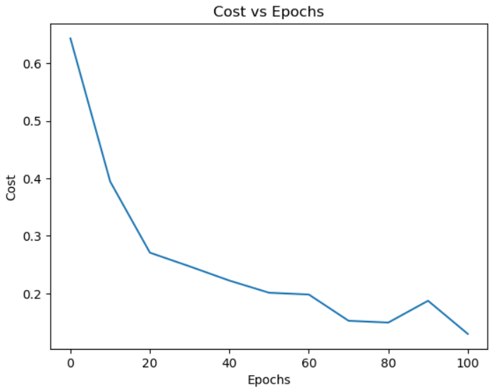
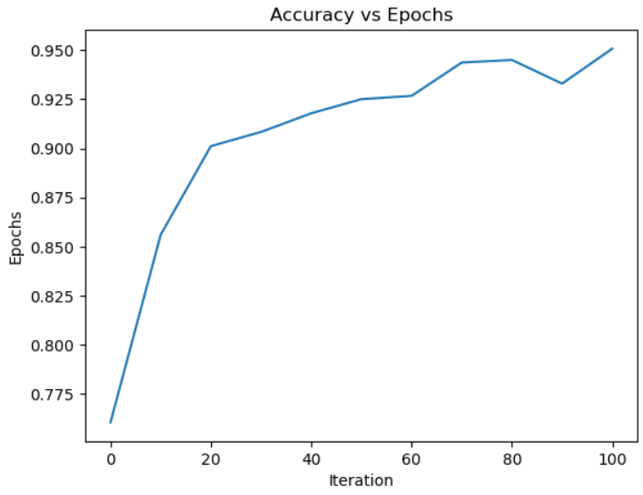
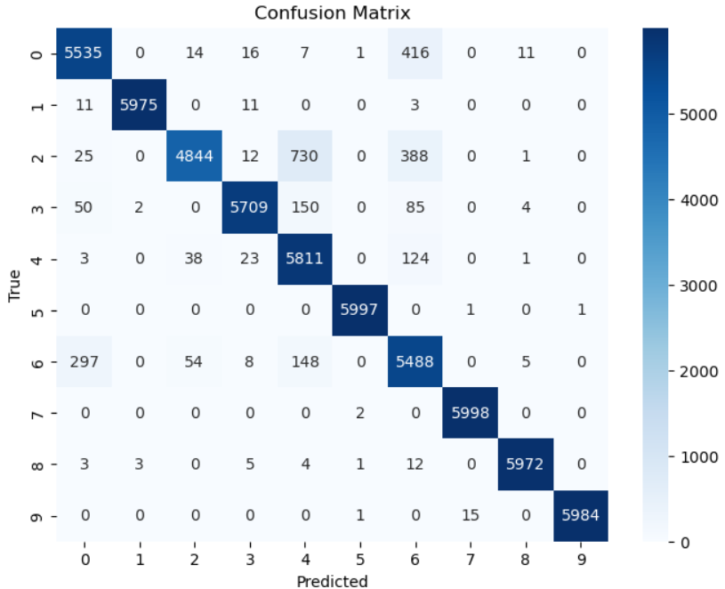

# Fashion-MNIST Classification using Neural Network (From Scratch)

This project implements a fully connected deep neural network from scratch using **NumPy** to classify Fashion-MNIST images into 10 clothing categories.

No deep learning frameworks (TensorFlow / PyTorch / Keras) were used.
All core components — forward propagation, backpropagation, mini-batch SGD, and cross-entropy loss — were implemented manually.

---

## Dataset

Download the Fashion-MNIST dataset from here: [Fashion MNIST](https://www.kaggle.com/datasets/zalando-research/fashionmnist)

## Project Overview

**Dataset:** Fashion-MNIST (CSV format)

* Total training samples: 60,000
* Image size: 28 × 28 pixels (784 features)
* Classes: 10 clothing categories
* Pixel normalization: Scaled to **[0, 1]**

**Libraries used:**

* NumPy
* Pandas
* Matplotlib
* Seaborn

---

## Neural Network Architecture

Input Layer: 784 neurons
Hidden Layer 1: 128 neurons — ReLU
Hidden Layer 2: 10 neurons — ReLU
Output Layer: 10 neurons — Softmax

```
784 → 128 → 10 → 10
```

---

## Features Implemented

* Manual parameter initialization
* Forward propagation
* Backward propagation
* ReLU activation and derivative
* Softmax activation
* Cross-entropy loss
* Mini-batch Stochastic Gradient Descent (SGD)
* One-hot encoding of labels
* Accuracy tracking
* Cost vs Epochs visualization
* Accuracy vs Epochs visualization
* Confusion matrix
* Sample prediction visualization

---

## Training Details

* Optimizer: Mini-batch SGD
* Learning rate: **0.1**
* Epochs: **110**
* Batch size: **64**
* Weight initialization: Random (shifted to include negative values)

Parameter update rule:

```
W = W − α dW  
b = b − α db
```

---

## Cost Function

Cross-Entropy Loss for multi-class classification:

```
J = -(1/m) Σ Σ y log(a)
```

Where:

* **y** → one-hot encoded true labels
* **a** → predicted softmax probabilities

---

## Results

### Cost vs Epochs



### Accuracy vs Epochs



### Confusion Matrix



---

## Performance

* Cost decreases steadily during training
* Accuracy improves and stabilizes with epochs
* Confusion matrix shows strong diagonal dominance
* Model performs well on unseen test data

---

## Sample Predictions

The notebook includes visualization of individual predictions with their true labels for qualitative evaluation.

---

## Project Structure

```
.

├── Fashion_MNIST_NN_from_scratch.ipynb
├── assets
│   ├── cost_vs_epochs.png
│   ├── accuracy_vs_epochs.png
│   └── confusion_matrix.png
└── README.md
```

---

## How to Run

### 1. Clone the repository

```
git clone https://github.com/DhanunjayVemu/Fashion-MNIST-Neural_Network_Scratch.git
```

### 2. Install dependencies

```
pip install numpy pandas matplotlib seaborn
```

### 3. Run the notebook

Open:

```
Fashion_MNIST_NN_from_scratch.ipynb
```

Run all cells sequentially.

---

## What I Learned

* Implementing deep neural networks using only NumPy
* Matrix-based forward and backward propagation
* Role of activation functions in deep networks
* Softmax + cross-entropy gradient simplification
* Mini-batch SGD and its effect on convergence
* Debugging shape and broadcasting issues
* Evaluating models using confusion matrices

---

## Author

**Vemu Venkat Sai Dhanunjay Sharma**
B.Tech Student
Passionate about Machine Learning, Neural Networks, and Systems Programming


---

## License

This project is open-source and available for educational and research purposes.

---
